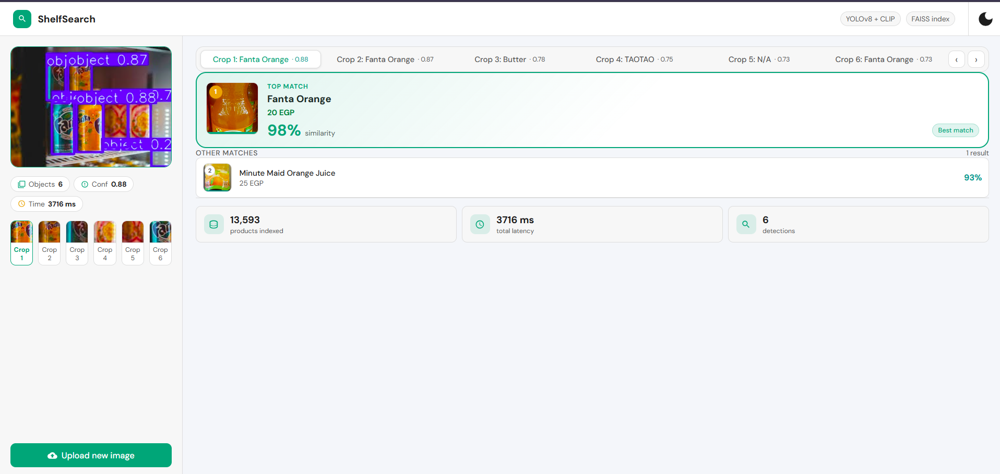

# Supermarket Product Visual Search Engine

A Flask-based web application for identifying supermarket products from user-uploaded images. The system combines object detection, image embeddings, and similarity search to detect product regions, match them against a catalog, and return likely product names, prices, and confidence scores.

## Project Summary

This project was built to explore a practical retail computer vision workflow:

1. Detect product-like regions in an image using YOLO.
2. Crop and analyze each detected region.
3. Match each crop against a catalog using CLIP embeddings and FAISS search.
4. Return the best product candidates with optional price information.

The result is a lightweight and extensible visual search system that can be used for shelf monitoring, product recognition, and catalog-based retrieval.

## Screenshot

<p align="center">
	
</p>

Place the screenshot you shared in `assets/screenshot.png` so it renders directly in the README on GitHub.

## Key Features

- Upload an image of a shelf, checkout, or product scene
- Detect objects with YOLOv8
- Match detected regions to known catalog items using CLIP + FAISS
- Return product name, price, and confidence estimate
- Support an admin interface for adding new catalog items and images
- Include a fallback path for whole-image matching when no detections are found

## Tech Stack

- Backend: Flask
- Object detection: Ultralytics YOLOv8
- Embeddings: CLIP (ViT-B/32 via open-clip)
- Vector search: FAISS
- Image processing: OpenCV and Pillow
- Data handling: NumPy, pandas
- UI: Flask templates and browser-based rendering

## Model and Search Pipeline

The application uses a two-stage pipeline:

- YOLO detects where product-like objects appear in the image.
- CLIP generates visual embeddings for the detected crops.
- FAISS searches the catalog for the closest matches.
- Optional color histogram re-ranking helps disambiguate visually similar packaging.

### Model Details

- Detector: YOLOv8 single-class product detector
- Pretrained weights: pretrainedsku-110k.pt
- Embedding model: CLIP ViT-B/32
- Search backend: FAISS IndexFlatIP
- Matching strategy: normalized embedding similarity with optional reranking

## Data and Catalog Storage

This project does not rely on a traditional SQL database.

Instead, the catalog is stored and indexed using:

- Local product images in the catalog folders
- A FAISS index at data/embeddings/faiss_index_clip.bin
- Metadata persistence in data/embeddings/metadata_clip.pkl

This makes the catalog easy to extend by adding new product images without retraining the detector for each new item.

## Project Structure

- app/ - Flask application and HTML templates
- models/ - search, training, and evaluation logic
- data/ - dataset preparation, embeddings, and index assets
- assets/ - README screenshots and other presentation images
- scripts/ - catalog indexing and maintenance utilities
- catalog/ - sample catalog images
- pretrainedsku-110k.pt - YOLO model weights

## Installation

### 1. Clone the repository

```bash
git clone <repository-url>
cd <repository-folder>
```

### 2. Install dependencies

```bash
pip install -r requirements.txt
```

> The first run may download the CLIP model weights, which can be large.

### 3. Start the app

```bash
python app/app.py
```

Then open:

```text
http://127.0.0.1:5000/
```

## Configuration

You can customize the detection and matching behavior with environment variables in a .env file:

```env
YOLO_CONF_THRESHOLD=0.30
SIMILARITY_THRESHOLD=0.40
MIN_CROP_SHARPNESS=50.0
MAX_IMAGE_DIMENSION=2000
COLOR_WEIGHT=0.30
ADMIN_KEY=your-secret-key
```

## Usage

### Main interface

Open the homepage to upload an image and inspect detections.

### Admin interface

Use the admin page to add products and images to the catalog.

## Training and Evaluation Notes

The repository includes scripts for:

- training YOLO on product-detection datasets
- evaluating detector performance
- building and rebuilding the FAISS catalog index
- preparing data for training and search

## Limitations

- The detector is general-purpose rather than a full brand classifier.
- Product identity depends heavily on the catalog and retrieval pipeline.
- The current FAISS index is a flat index, which is sufficient for the present scale but may need optimization for larger catalogs.

## Future Work

Possible next steps include:

- larger-scale indexing with ANN methods
- OCR-based verification for difficult cases
- improved robustness for cluttered shelf scenes
- deployment to a cloud-hosted environment

## License

This project is intended for research, educational, and demonstration purposes.
